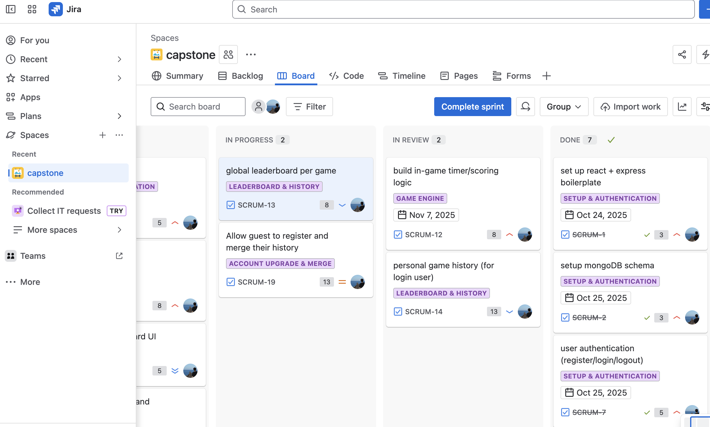

# Game platform
- allow users to play game without register
- registered users are able to update/delete their profile
- registered user able to access their personal dashboard
- both guest and registered users are able to view top10 leaderboard
- allow guest to upgrade their account

[Link to backend](https://github.com/xiaochendev/capstone-backend)


# Steps
**KEEP SERVER(backend) RUNNING**

1. Copy rerepository to your local file
```
git clone https://github.com/xiaochendev/capstone-frontend.git
```

2. Change direcotry to ex. capstone-frontend
```
cd capstone-frontend
```

3. Install all the required dependencies
```
npm install
```

4. Start the frontend
```
npm run dev
```

5. Its viewable in your browser by entering

```
http://localhost:5173/
```

# API References - frontend
| **Route**          | **Description**                          | **Access**             |
|--|--|--|
|`/`                 | Home Page                                | Public                 |
| `/dashboard`       | Dashbord Page                            | Private: guest or user |
| `/game`            | Game Page                                | Private: guest or user |
| `/auth/login"`     | Auth Page                                | Public                 |


# Technologies
- React.js
- Node.js
- Express.js
- Mongoose

# Reflections
- Did you deliver a project that met all of the technical requirements?
    Yes
- Given what the class has covered, did you build something reasonably complex?
    Yes
- Did you add a personal touch or a creative element into your project submission?
    Yes
- Did you deliver something of value to the end-user (not just a login button and an index page)?
    Yes
- Did you follow the code style guidance and exercise best practices?
    Yes
- Did you provide an appropriate level of comments?
    Yes
- Did you try to deploy your application to a public URL as a personal stretch goal?
    NA

# Presentation
    - short overview of application
    - highlight use case of app
    - highligh tech functionality [high-level perspective]
    - what i learned through the dev of the app
        authentication, specifically cookies, and stick with your original plan first, before tried any more fancy features.
    - additional features could be added inthe future
        Added more games, more responsive history in user dashboard

### Capstone Breakdown:
 - Project Approvals:
    - What is your app and why?
        - Game platform, allow users/guests to play various games, because just wanna play a quick game.
    - What is the shape/model of your data?
        - User
            - username,
            - email,
            - passwordHash,
            - isGuest: Boolean
        - Game
            - name,
            - description,
            - type
        - GameSeesion
            - userId, 
            - gameId,
            - ? score,
            - timeToComplete,
            - isCompleted
    - What are your CRUD Routes?
        - user
            - POST register/create a user account
            - POST login user
            - PUT update user profile (pw, username)
            - DELETE user
        - game
            - POST new gameSession
        - dashboard
            - public
                - GET show top N players in global
            - private (Registered users only)
                - GET personal game history
                - DELETE personal game history
    - Wireframe/what are your 4 pages?
        - home:  ??? guest/register/login
        - game: play
        - dashboard (public)
        - dashboard (private): shows personal info and game history

 - FrontEnd:
    - 4 pages (react-router-dom)
    - Manage state using ReactHooks or other state MGMT tools (useState, useReducer, redux, useEffect)
    - Full C.R.U.D capabilities from your DB
 - Backend/Server:
    - Connect to your DB
    - Effective Error Handling
    - C.R.U.D capabilities
 - Documentation:
    - Well documented readme
    - Full Commit history, 25 commits- ish
    - Presentation
 - Extra Credit:
    - using JIRA or other project tracking software 1%
    - typescript 3%
    - authentication 2%